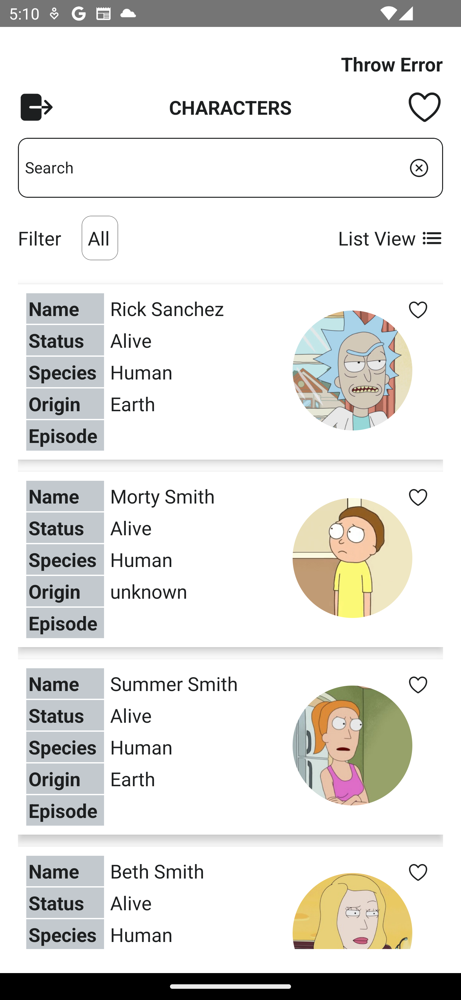

# Lendsqr FP News

This repository contains the source code for the **Lendsqr FP News** application, built with React Native. The app utilizes the Rick and Morty API for demonstration purposes instead of the Free News API. The application is designed to showcase best practices in React Native development, including state management, navigation, and integration with various Firebase services.

## Table of Contents

- [Features](#features)
- [Screens](#screens)
- [Technologies Used](#technologies-used)
- [Firebase Integration](#firebase-integration)
- [Installation](#installation)
- [Running the App](#running-the-app)
- [Implementation Details](#implementation-details)
- [Screenshots](#screenshots)
- [Testing](#testing)
- [Error Handling](#error-handling)
- [Over-the-Air Updates](#over-the-air-updates)

## Features

1. **Character Listing**: Display a list of characters from the Rick and Morty API with details such as name, status, species, origin, and episode.
2. **Character Details**: View detailed information about a selected character.
3. **Favorites**: Add or remove characters from favorites.
4. **Sign Up**: Users can sign up using their Google accounts.
5. **Login**: Users can log in using their Google accounts.
6. **Error Handling**: A button to simulate runtime errors for testing Crashlytics.
7. **Middleware**: Log user activities and screen changes using Firebase events.

## Screens

1. **Character Listing**: Shows characters with options to search, filter, and toggle the view (list/grid).
2. **Character Details**: Displays detailed information about the selected character.
3. **Favorites**: List of favorite characters.

## Technologies Used

- **React Native**: For building mobile applications.
- **Redux Toolkit**: For state management.
- **Axios**: For making API requests.
- **React Navigation**: For navigation.
- **CodePush**: For over-the-air updates.
- **Firebase**: For analytics, remote configuration, performance monitoring, and crash reporting.

## Firebase Integration

The following Firebase services are integrated:

- **Crashlytics**: For tracking crashes.
- **Performance Monitoring**: To monitor app performance.
- **Remote Config**: For remote configurations.
- **Analytics**: To log user activities and screen changes.
- **Messaging**: For push notifications.

## Installation

1. Clone the repository:

   ```sh
   git clone https://github.com/codefreak13/lendsqr-fp-news.git

   cd lendsqr-fp-news
   ```

### Running the App

For Android:

```sh
npx react-native run-android
```

For iOS:

```sh
npx pod-install
npx react-native run-ios
```

## Implementation Details

### Navigation

- **React Navigation**: Used for navigating between screens.
- **APP_ROUTE**: Enum for defining routes.

### State Management

- **Redux Toolkit**: For managing the application state.

### API Integration

- **Rick and Morty API**: Used for fetching character data.
- **Axios**: For making HTTP requests.

### Firebase Middleware

- Logs user activities and screen changes using Firebase events.

### Error Handling

- A button on the news listing screen to simulate runtime errors for testing Crashlytics.

## Screenshots

### Character Listing



### Favorite Characters


## Testing

- **Unit Tests**: Written for components and hooks.
- **Jest**: For running tests.
- **Mocking**: Mocking Firebase analytics for tests.

## Error Handling

- All exceptions are handled gracefully with user-friendly messages.
- Crashlytics is used to log runtime errors.

## Over-the-Air Updates

- **CodePush**: Integrated for over-the-air updates to deliver new features and bug fixes without requiring users to update the app via the app store.
